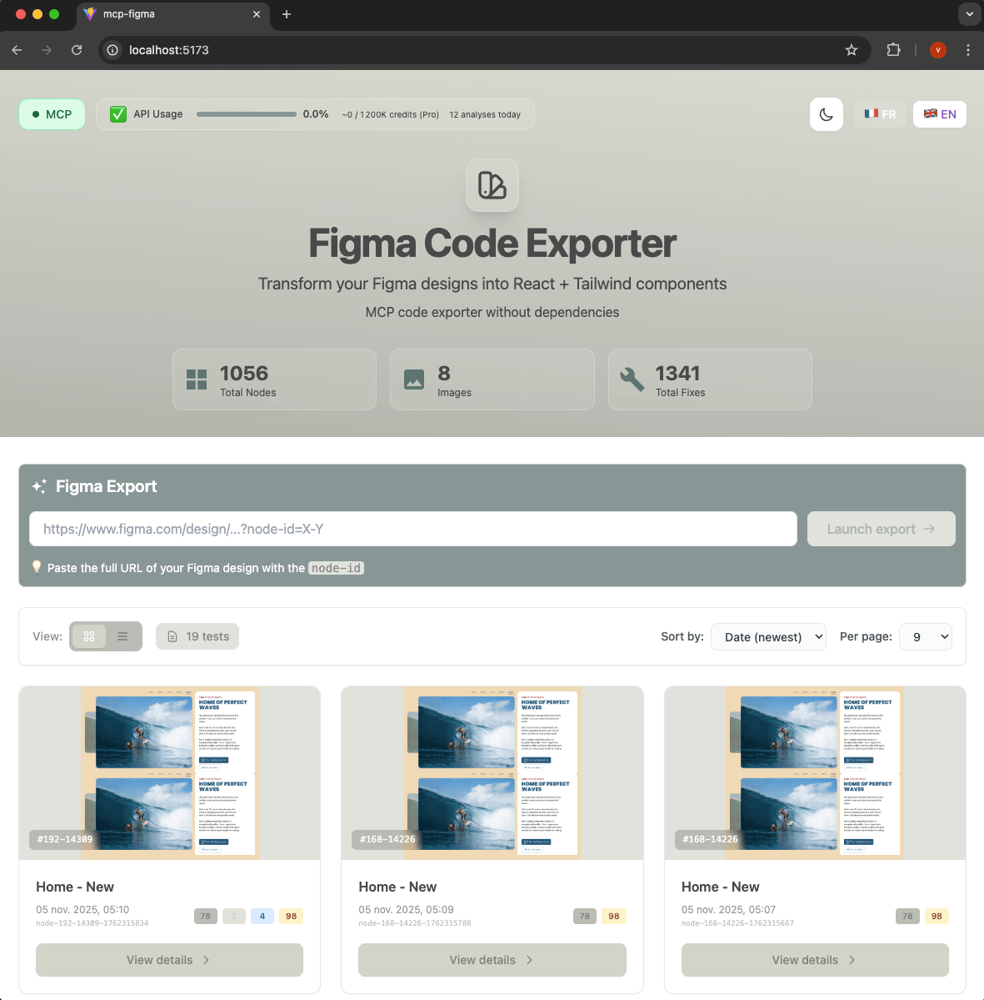
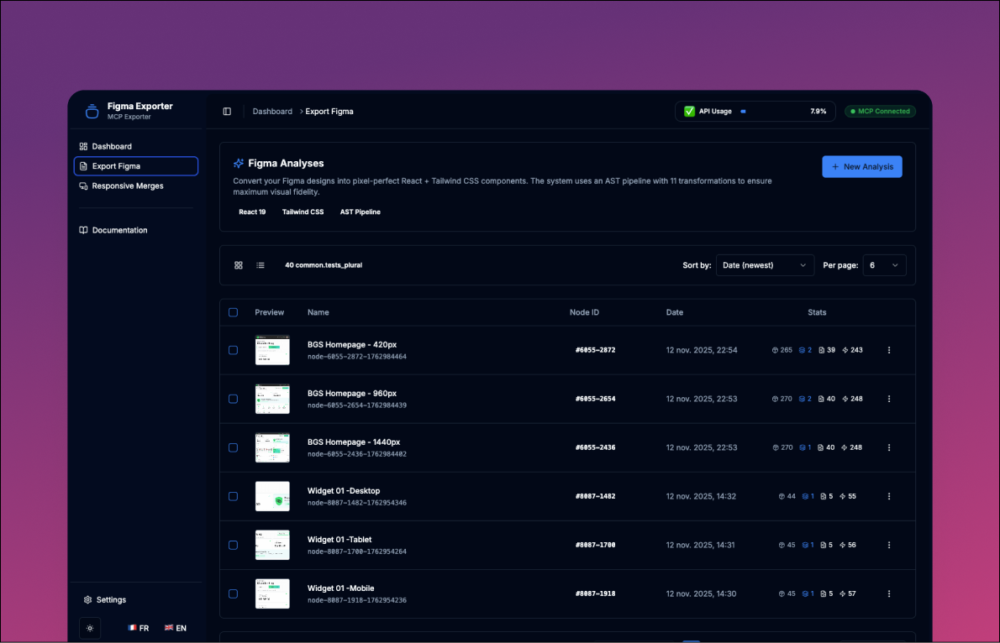
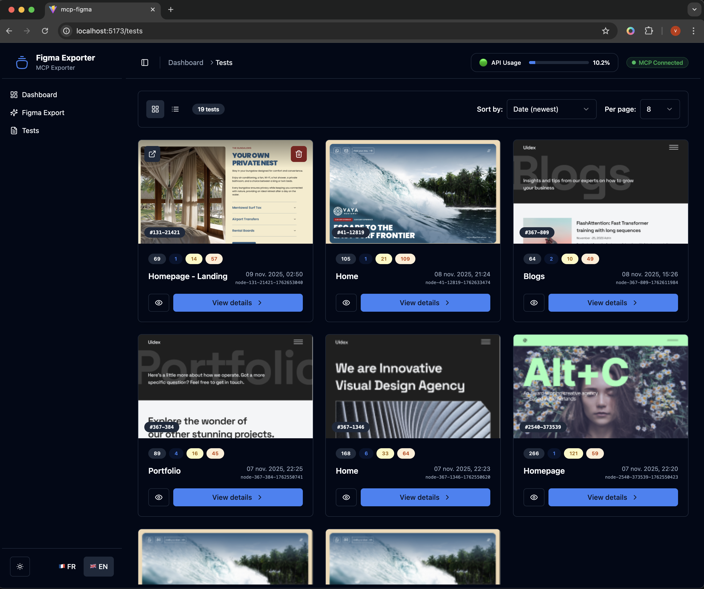
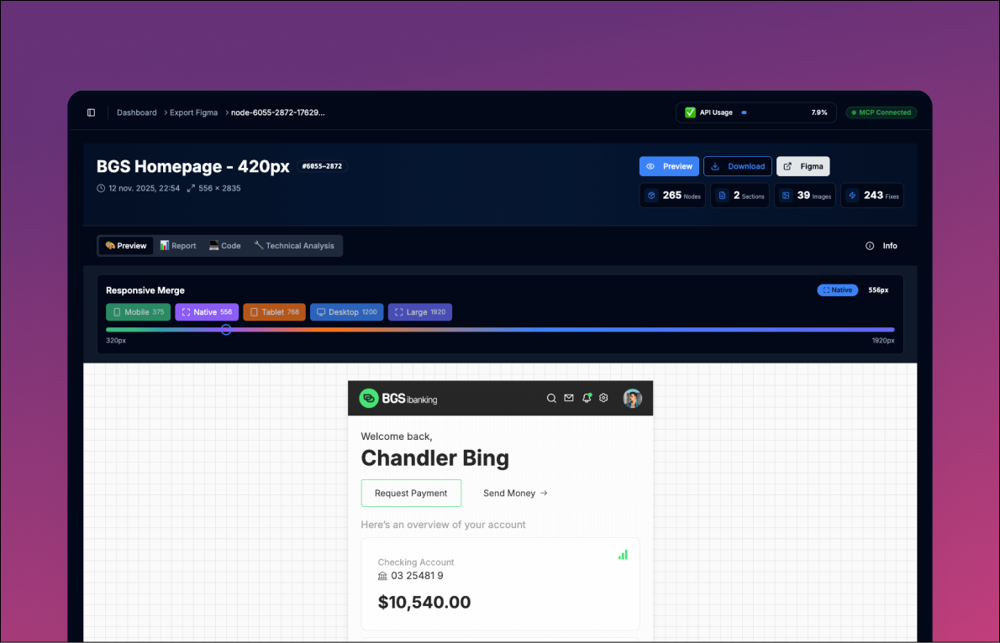
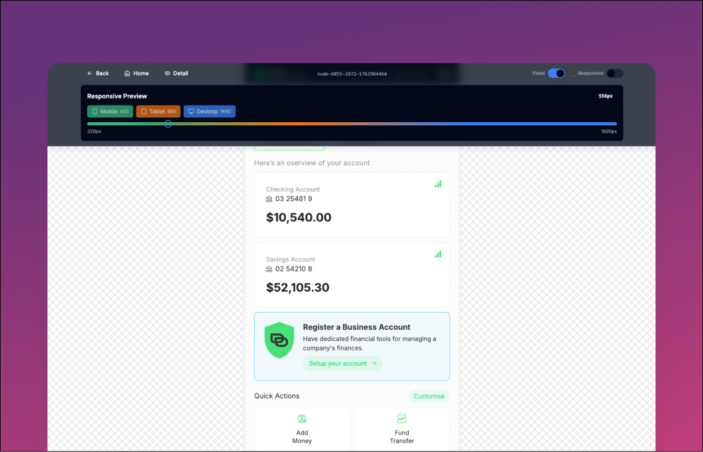

# 🎨 MCP Figma to Code

https://github.com/user-attachments/assets/823e50c7-fb4d-4ea2-a6da-b2a8413bf1a7

> Transform your Figma designs into pixel-perfect React + Tailwind components using the Model Context Protocol

<div align="center">

```ascii
╔════════════════════════════════════════════════════════════╗
║                                                            ║
║     ┌─────────┐                         ┌─────────┐        ║
║     │  FIGMA  │  ─── MCP Protocol ───>  │  REACT  │        ║
║     │ DESIGN  │                         │   CODE  │        ║
║     └─────────┘                         └─────────┘        ║
║          │  1. Extract via MCP               │             ║
║          │  2. AST Processing                │             ║
║          │  3. Visual Validation             │             ║
║          └───── Code Fidelity ───────────────┘             ║
║                                                            ║
╚════════════════════════════════════════════════════════════╝
```

[](https://opensource.org/licenses/MIT)
[](https://reactjs.org/)
[](https://www.typescriptlang.org/)
[](https://tailwindcss.com/)
[](https://ui.shadcn.com/)
[](https://www.docker.com/)

[Features](#-features) • [Quick Start](#-quick-start) • [Documentation](#-documentation) • [Contributing](#-contributing)

</div>

---

## 📸 Dashboard Interface


*Modern dashboard built with shadcn/ui - featuring real-time analytics, test management, and MCP status monitoring*

---

## ⚠️ Project Status

> **MVP in Active Development** - This tool works great for most designs, but some edge cases are still being refined.

### ✅ What Works
- Complex Figma layouts with automatic chunking
- Gradients, shadows, blend modes, stroke alignment
- Design token extraction (colors, fonts, spacing)
- Visual validation with Puppeteer
- Interactive dashboard with shadcn/ui components
- Real-time MCP connection monitoring

### 🔧 Roadmap
- Component variants support
- Animation & interaction states
- Advanced component library mapping
- Better handling of deeply nested components

**Contributions welcome!** ⭐ Star the repo • 🐛 Report bugs • 💡 Suggest features • 🔨 Submit PRs

---

## 🌟 Features

### 🎯 Pixel-Perfect Conversion
- **Visual Fidelity** - Automated validation ensures code matches Figma design exactly
- **Smart Chunking** - Handles designs of any size by splitting into manageable pieces
- **11 AST Transforms** - Specialized Babel transforms optimize generated code
- **Advanced Graphics** - Full support for gradients, shadows, blend modes, custom shapes
- **Design Tokens** - Automatic CSS variables for colors, spacing, typography

### 🚀 Dual Output Modes

| Mode | Files | Purpose |
|------|-------|---------|
| **Fixed** | `Component-fixed.tsx/css` | Tailwind-based (requires safelist config) |
| **Clean** | `Component-clean.tsx/css` | Pure CSS, zero dependencies, copy/paste ready |

Both versions generated automatically via CLI `--clean` flag or dashboard.

### 📊 Modern Dashboard (shadcn/ui)

**New Architecture:**
- Built with **shadcn/ui** + Radix UI primitives
- **Dark/Light mode** with system preference detection
- **i18n support** (EN/FR) with language switcher
- **Sidebar navigation** with collapsible menu
- **Charts & Analytics** - Timeline, KPIs, test statistics

**Pages:**
- **Dashboard** - KPIs, charts, recent activity
- **Analyze** - Launch new Figma analyses with real-time logs
- **Export Figma** - Grid/List view with pagination, sorting, filtering
- **Export Figma Detail** - 4-tab interface (Preview, Code, Report, Technical)

**Features:**
- Responsive preview with slider (320px → 1920px)
- Syntax-highlighted code viewer
- Visual fidelity report (Figma vs Web)
- Real-time API usage tracking
- MCP connection status indicator

### 🔧 Developer Experience
- **MCP Protocol** - Direct Figma Desktop integration (no API keys)
- **Docker Support** - One-command setup with hot reload
- **TypeScript** - Full type safety across codebase
- **Modular Architecture** - Features organized by domain

### 📱 Responsive Merge (Multi-Screen Fusion)

**Combine 3 Figma screens (Desktop, Tablet, Mobile) into a single responsive component:**

- **Intelligent Merging** - Detects common components across breakpoints
- **Pure CSS Media Queries** - No framework dependencies, works everywhere
- **Conflict Detection** - Identifies and resolves className conflicts
- **Modular Output** - Generates `Page.tsx` + `Subcomponents/` structure
- **Puck Integration** - Visual editor-ready components
- **Visual Reports** - Side-by-side comparison across breakpoints

**Process:**
1. Export 3 Figma screens (Desktop 1440px, Tablet 960px, Mobile 420px)
2. Use dashboard to create a responsive merge
3. Get a single responsive component with media queries
4. Visual editor (Puck) for easy customization

**For details:** See [Responsive Merge Guide](docs/RESPONSIVE_MERGE.md)

---


*Simple Form With Visible Comamand Line*

---


*Grid list of all exported Code*

---


*View list of all exported Code*

---


*Detailled exported page with responsive merge preview*

---

## 🚀 Quick Start

### Prerequisites

| Tool | Version | Purpose |
|------|---------|---------|
| **Docker** + Docker Compose | Latest | Container runtime (recommended) |
| **MCP Figma Desktop** | Latest | Figma integration server (port 3845) |
| **Node.js** (optional) | 20+ | For local development |

### Installation (Docker)

```bash
# 1. Clone repository
git clone https://github.com/vincegx/Figma-to-Code.git
cd Figma-to-Code

# 2. Start Docker (dependencies install automatically inside container)
docker-compose up --build

# 3. Open dashboard
# http://localhost:5173
```

**That's it!** 🎉 The dashboard is now running.

### For Developers (Optional)

If you want IDE support (IntelliSense, linting):

```bash
# Install dependencies locally (optional - for IDE only)
npm install

# Note: Chromium is NOT downloaded (configured in .npmrc)
# The app MUST run in Docker for full functionality (MCP + Puppeteer)
```

### Verify MCP Connection

```bash
# Check MCP server is accessible
curl http://localhost:3845/mcp

# Dashboard should show: 🟢 MCP Connected
```

### Your First Analysis

1. Ensure Figma Desktop is running
2. Open dashboard at [http://localhost:5173](http://localhost:5173)
3. Navigate to **Analyze** page
4. Paste your Figma URL:
   ```
   https://www.figma.com/design/FILE_ID?node-id=X-Y
   ```
5. Click "Launch Export"
6. Watch real-time logs in the modal
7. View results in the **Export Figma** page

### Reprocessing Exports (No MCP Calls)

Already have an export but need to regenerate files? Use the reprocess command:

```bash
# Find your export ID
ls src/generated/export_figma/
# Example: node-8132-3793-1763118767

# Reprocess with Tailwind version only
./cli/figma-reprocess node-8132-3793-1763118767

# Reprocess with both Tailwind + Clean versions
./cli/figma-reprocess node-8132-3793-1763118767 --clean
```

**What it does:**
- Re-runs AST transformations (Phase 2)
- Recaptures web screenshot (Phase 3)
- Regenerates reports and dist package (Phase 4)
- Uses existing `Component.tsx` (no MCP calls = faster)

**Use cases:**
- Modified transform configuration and want to re-apply
- Need clean version but forgot `--clean` flag initially
- Screenshot failed and want to retry
- Testing transform changes during development

---

## 📖 Documentation

Comprehensive guides available in the `/docs` folder:

| Guide | Description |
|-------|-------------|
| **[Architecture](docs/ARCHITECTURE.md)** | Detailed system architecture, tech stack, pipeline flow |
| **[Development](docs/DEVELOPMENT.md)** | Developer guide, adding transforms, contributing |
| **[Transformations](docs/TRANSFORMATIONS.md)** | Complete AST transform reference |
| **[Responsive Merge](docs/RESPONSIVE_MERGE.md)** | Multi-screen fusion, responsive pipeline, Puck integration |
| **[Troubleshooting](docs/TROUBLESHOOTING.md)** | Common issues and solutions |
| **[API Reference](docs/API.md)** | REST API & SSE endpoints documentation |
| **[CLAUDE.md](CLAUDE.md)** | AI assistant guidance (for Claude Code) |

### Quick Links

**Architecture:**
- [4-Phase Pipeline](docs/ARCHITECTURE.md#pipeline)
- [Component Structure](docs/ARCHITECTURE.md#component-structure)
- [MCP Integration](docs/ARCHITECTURE.md#mcp-integration)

**Development:**
- [Adding Transforms](docs/DEVELOPMENT.md#adding-transforms)
- [Testing Strategy](docs/DEVELOPMENT.md#testing)
- [Docker Setup](docs/DEVELOPMENT.md#docker)

**Usage:**
- [CLI Commands](docs/ARCHITECTURE.md#cli-usage)
- [Reprocessing Exports](#reprocessing-exports-no-mcp-calls) - Regenerate files without MCP calls
- [API Endpoints](docs/API.md)
- [Configuration](docs/DEVELOPMENT.md#configuration)

---

## 💡 How It Works

### 4-Phase Pipeline

```
Phase 1: EXTRACTION (MCP)
├─ Connect to Figma Desktop (port 3845)
├─ Extract metadata.xml (hierarchy)
├─ Extract parent-wrapper.tsx
├─ Extract chunks (1s delay between calls)
└─ Save design tokens, screenshot

Phase 2: PROCESSING (AST)
├─ Organize images (Figma names)
├─ Process each chunk:
│  ├─ Parse to AST
│  ├─ Apply 11 transforms (priority 10-100)
│  └─ Extract CSS
├─ Consolidate chunks → Component-fixed.tsx
├─ Merge CSS → Component-fixed.css
├─ Generate clean version → Component-clean.tsx/css
├─ Optimize CSS/TSX → Component-optimized.tsx/css (sync-optimizer.js)
└─ Split components → components/*.tsx/css (if --split-components)

Phase 3: VALIDATION (Visual)
├─ Launch Puppeteer
├─ Render at exact dimensions
└─ Capture web-render.png

Phase 4: OUTPUT (Reports)
├─ metadata.json (dashboard)
├─ analysis.md (technical)
└─ report.html (visual comparison)
```

### Responsive Merge Pipeline

**Multi-Screen Fusion** - Combines 3 Figma exports into one responsive component:

```
Phase 1: DETECTION & VALIDATION
├─ Validate 3 exports have modular/ directory
├─ Detect common components across breakpoints
├─ Extract component order from Desktop metadata.xml
└─ Extract helper functions from Desktop

Phase 2: COMPONENT MERGING (Responsive AST)
├─ Parse Desktop, Tablet, Mobile TSX → AST
├─ Run 7 responsive transforms (priority 10-70):
│  ├─ Detect missing elements
│  ├─ Normalize className formatting
│  ├─ Detect className conflicts
│  ├─ Merge Desktop-first (base + overrides)
│  ├─ Add horizontal scroll
│  ├─ Reset conflicting properties
│  └─ Inject visibility classes
├─ Inject helper functions if needed
└─ Fix image paths (./img/ → ../img/)

Phase 3: CSS MERGING
├─ Desktop styles (baseline, no media query)
├─ Tablet overrides (@media max-width: 960px)
├─ Mobile overrides (@media max-width: 420px)
└─ Compile responsive classes to pure CSS

Phase 4: PAGE GENERATION
├─ Merge Page structure from 3 Component-clean.tsx
├─ Replace <div data-name> with <ComponentName />
├─ Generate Page.tsx + Page.css
├─ Generate Puck components (visual editor)
└─ Create visual report + technical analysis
```

**Output:** `responsive-merger-{timestamp}/` with `Page.tsx`, `Subcomponents/`, `puck/`, and reports.

**For details:** See [Responsive Merge Guide](docs/RESPONSIVE_MERGE.md)

### Key Concepts

**Adaptive Processing:**
Two modes automatically selected based on design complexity:
- **Simple Mode** - Direct processing for small, valid designs (4 MCP calls)
- **Chunk Mode** - Split processing for large/complex designs (5+N MCP calls)

**Single-Pass AST:**
Transforms sorted by priority (10→100), all execute in one traversal for performance.

**Dual Output:**
`-fixed` uses Tailwind utilities, `-clean` uses pure CSS classes.

**Visual Validation:**
Puppeteer captures web render at exact Figma dimensions for pixel-perfect comparison.

**Responsive Merge (Multi-Screen):**

Three key strategies power the responsive merge system:

- **Desktop-First Approach** - Desktop layout serves as baseline, Tablet/Mobile become progressive overrides via media queries
- **Component Matching** - Automatically detects common components across breakpoints by name (e.g., "Header" present in Desktop, Tablet, Mobile)
- **Conflict Resolution** - Uses `data-name` attributes and positional matching to identify corresponding elements, then merges classNames intelligently
- **Media Query Generation** - Calculates CSS differences between breakpoints, generates optimized `@media` rules (Desktop → Tablet @960px → Mobile @420px)
- **Helper Injection** - Extracts shared utilities (like `formatCurrency()`, icon components) from Desktop and auto-injects where needed
- **Pure CSS Output** - Compiles responsive classes (`max-md:w-80`) to pure CSS, zero dependencies
- **Puck Integration** - Visual editor for drag-and-drop customization post-merge

**Example workflow:**
```
Desktop (1440px) → Export with --split-components
Tablet (960px)   → Export with --split-components  } → Responsive Merge
Mobile (420px)   → Export with --split-components

Result: Page.tsx + Subcomponents/ with media queries
```

**For more details:** See [Architecture Guide](docs/ARCHITECTURE.md) and [Responsive Merge Guide](docs/RESPONSIVE_MERGE.md)

---

## 📦 Output Structure

### Single-Screen Export

Each analysis creates a folder in `src/generated/export_figma/`:

```
node-{id}-{timestamp}/
├── Component-fixed.tsx          # Tailwind version
├── Component-fixed.css          # Consolidated CSS
├── Component-clean.tsx          # Pure CSS version (if --clean)
├── Component-clean.css          # Production CSS (if --clean)
├── chunks-fixed/                # Processed chunks
│   ├── Header.tsx
│   └── Header.css
├── img/                         # Organized images
├── metadata.json                # Dashboard metadata
├── analysis.md                  # Technical report
├── report.html                  # Visual comparison
├── figma-render.png             # Reference screenshot
└── web-render.png               # Validation screenshot
```

### Responsive Merge (Multi-Screen)

Each responsive merge creates a folder in `src/generated/responsive-screens/`:

```
responsive-merger-{timestamp}/
├── Page.tsx                      # Main page component
├── Page.css                      # Consolidated CSS with media queries
├── Subcomponents/                # Modular responsive components
│   ├── Header.tsx                # Desktop-first with responsive classes
│   ├── Header.css                # Media queries: tablet/mobile
│   ├── Hero.tsx
│   ├── Hero.css
│   ├── Footer.tsx
│   └── Footer.css
├── img/                          # Images (from Desktop export)
│   ├── logo.png
│   └── hero-bg.jpg
├── puck/                         # Puck visual editor
│   ├── components/               # Puck-wrapped components
│   │   ├── Header.tsx
│   │   ├── Hero.tsx
│   │   └── Footer.tsx
│   ├── config.tsx                # Puck configuration
│   └── data.json                 # Initial Puck data
├── responsive-metadata.json      # Merge stats + transformation details
├── responsive-analysis.md        # Technical analysis report
└── responsive-report.html        # Visual comparison (Desktop/Tablet/Mobile)
```

**Key files:**
- `Page.tsx` - Main page importing all subcomponents
- `Subcomponents/*.tsx` - Modular components with responsive classNames
- `*.css` - Pure CSS with media queries (no Tailwind dependencies)
- `puck/` - Visual editor for drag-and-drop customization

---

## 🔧 Configuration

### Environment Variables

```env
# Puppeteer
PUPPETEER_EXECUTABLE_PATH=/usr/bin/chromium

# MCP Server (default values)
MCP_SERVER_HOST=host.docker.internal
MCP_SERVER_PORT=3845

# API Server
PORT=3000
```

### Transform Configuration

Enable/disable transforms in `scripts/config.js`:

```javascript
export const defaultConfig = {
  'font-detection': { enabled: true },
  'auto-layout': { enabled: true },
  'ast-cleaning': { enabled: true },
  // ... 8 more transforms
}
```

### Docker Ports

```yaml
# docker-compose.yml
ports:
  - "5173:5173"  # Dashboard + API
```

---

## 🐛 Troubleshooting

**MCP Not Connected?**
```bash
# 1. Verify Figma Desktop is running
# 2. Check MCP server
curl http://localhost:3845/mcp

# 3. Check from Docker
docker exec mcp-figma-v1 curl http://host.docker.internal:3845/mcp
```

**Images Not Appearing?**
```bash
# Re-organize images
docker exec mcp-figma-v1 node scripts/post-processing/organize-images.js \
  src/generated/export_figma/node-{id}
```

**Need to Regenerate Files?**
```bash
# Reprocess existing export (no MCP calls)
./cli/figma-reprocess node-{id}-{timestamp}

# With clean version
./cli/figma-reprocess node-{id}-{timestamp} --clean
```

**Component Won't Load?**
```bash
# Check for syntax errors
docker exec mcp-figma-v1 npm run lint

# Check browser console (F12)
```

**For comprehensive troubleshooting:** See [Troubleshooting Guide](docs/TROUBLESHOOTING.md)

---

## 🤝 Contributing

We welcome contributions! Here's how to get started:

### Quick Contribution Workflow

```bash
# 1. Fork & clone
git clone https://github.com/YOUR_USERNAME/Figma-to-Code.git

# 2. Create feature branch
git checkout -b feature/amazing-feature

# 3. Make changes & test
npm run lint
npm run build
docker-compose up --build

# 4. Test with real Figma designs
./cli/figma-analyze "https://www.figma.com/design/..."

# 5. Commit & push
git commit -m "feat: add amazing feature"
git push origin feature/amazing-feature

# 6. Open Pull Request
```

### Contribution Areas

- 🐛 **Bug Fixes** - Fix edge cases, improve stability
- ✨ **Features** - Add new transforms, improve pipeline
- 📚 **Documentation** - Improve guides, add examples
- 🎨 **UI/UX** - Enhance dashboard components
- 🧪 **Testing** - Add tests, validate edge cases

**For detailed guidelines:** See [Development Guide](docs/DEVELOPMENT.md#contributing)

---

## 📚 Resources

### Project Links
- [GitHub Repository](https://github.com/vincegx/Figma-to-Code)
- [Issues](https://github.com/vincegx/Figma-to-Code/issues)
- [Discussions](https://github.com/vincegx/Figma-to-Code/discussions)

### External Documentation
- [Model Context Protocol](https://github.com/anthropics/mcp) - MCP specification
- [Figma MCP Server](https://developers.figma.com/docs/figma-mcp-server/) - Figma Desktop integration
- [shadcn/ui](https://ui.shadcn.com/) - UI component library
- [Babel AST](https://babeljs.io/docs/en/babel-parser) - AST parsing docs
- [Tailwind CSS](https://tailwindcss.com/docs) - Utility classes reference

---

## 📄 License

This project is licensed under the **MIT License** - see [LICENSE](LICENSE) file for details.

```
MIT License - Copyright (c) 2025 MCP Figma to Code Contributors
```

---

## 🙏 Acknowledgments

- **Anthropic** - Model Context Protocol & Claude
- **Figma** - Design tool & MCP server implementation
- **shadcn** - Beautiful UI component library
- **React Team** - React 19
- **Tailwind Labs** - Tailwind CSS
- **All Contributors** - Thank you! 🎉

---

<div align="center">

**[⬆ Back to Top](#-mcp-figma-to-code)**

Made with ❤️ by [Vince](https://github.com/vincegx)

⭐ **Star this repo** if you find it useful!

</div>
